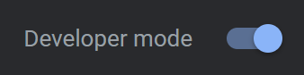
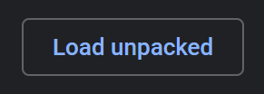
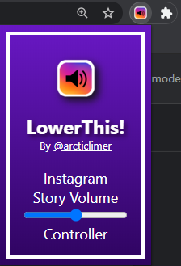

# <div align="center"><br>LowerThis!<br></div>

<br>

### What is it?

It's a chrome extension to control stories volume on Instagram. Since I don't own a Chrome Developer License, the extension can be downloaded here and installed on Chrome.

### How to install it?

#### Clone or manually download this repository:

```bash
git clone https://github.com/arcticlimer/lowerthis
```

#### Go to url: chrome://extensions

```url
chrome://extensions
```

#### If not active, activate Developer Mode:

# 

#### Select "Load unpacked" and load the extension root directory (the one that contains manifest.json)

# 

#### Done! You now can look at your extensions and open it.

# 

##### Note: Since the extension is not installed via Chrome App Store, it might not work properly in some Chrome versions or with other audio management extensions.
